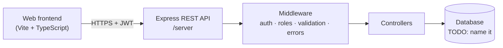

<div align="center">

# 🧭 Employee Ops Dashboard

**A full-stack employee operations platform, powered by a REST API I designed and built from scratch.**


[Overview](#-overview) · [Architecture](#-architecture) · [How I built the backend](#-how-i-built-the-backend) · [Frontend](#-the-frontend-built-with-tools) · [Getting started](#-getting-started) · [API](#-api-overview)

</div>

---

## ✨ Overview

Employee Ops Dashboard lets an organization manage its people and day-to-day operations from one place: authenticated users, role-based access, and a dashboard on top of a documented REST API.

> **Ownership at a glance:** the backend (API design, authentication, authorization, data layer) is my own work. The web frontend was generated with AI tools and connected to my API. Details in [The frontend](#-the-frontend-built-with-tools).

<!-- TODO: add 1-2 screenshots from /screenshots, e.g.
<p align="center"></p>
-->

### Key features

- 🔐 **Authentication** with JWT access and refresh tokens (TODO: confirm)
- 🛡️ **Role-based authorization**: routes are restricted by user role (TODO: list your roles, e.g. Admin / Manager / Employee)
- 👥 **Employee management**: create, read, update, delete (TODO: adjust to your actual features)
- 📊 **Operations dashboard** that consumes the API (TODO: list the dashboard's main widgets/pages)
- ⚙️ **Centralized error handling and request logging** via custom middleware (TODO: confirm)

---

## 🏗 Architecture



**Request flow:** the frontend calls the API with a token, middleware verifies the identity and role, a controller runs the business logic, and the data layer reads or writes the database.

---

## 🔧 How I built the backend

I built the API step by step, one layer at a time, so each piece was working before I added the next.

| # | Stage | What I built |
|---|-------|--------------|
| 1 | **Node.js foundations** | Modules, file system, npm packages, and an event-driven logger |
| 2 | **Express server** | App setup, routing, and structured route files |
| 3 | **Middleware layer** | Request logging, CORS configuration, and centralized error handling |
| 4 | **MVC REST API** | Separated routes, controllers, and models, with full CRUD endpoints |
| 5 | **Authentication** | Registration and login, password hashing, and JWT access and refresh tokens |
| 6 | **Authorization** | Role-based access control: a middleware checks the user's role per route |
| 7 | **Data layer** | TODO: database and how you model the data (tables/collections, migrations in `/migrations`) |

**Design decisions**

- **Separation of concerns.** Routes only map URLs, controllers hold logic, and models talk to the database.
- **Stateless auth.** Short-lived access tokens with refresh tokens, so the API needs no server-side sessions.
- **Secrets stay out of the repo.** Configuration lives in environment variables; see `.env.example`.

<!-- TODO: add 1-2 real details that only you would know, e.g. a bug you hit and how you fixed it, or why you chose your DB. This is what interviewers ask about. -->

---

## 🎨 The frontend (built with tools)

The interface was **generated with AI-assisted tools** and pointed at the API described above. I focused my time on the backend, since that's where the core logic, security, and data model live.

| Layer | Who / what |
|-------|-----------|
| REST API, auth, roles, data model | **Me**, designed and implemented by hand |
| Web UI (Vite + TypeScript) | Generated with AI tools, consuming my API |

---

## 🧰 Tech stack

| Area | Technology |
|------|-----------|
| Runtime and framework | Node.js, Express |
| Auth | JSON Web Tokens (JWT) |
| Database | TODO |
| Frontend | Vite, TypeScript (AI-generated) |
| Tooling | ESLint, Prettier, Git and GitHub |

---

## 🚀 Getting started

**Prerequisites:** Node.js 18+ (TODO: confirm), plus your database (TODO).

```bash
# 1. Clone
git clone https://github.com/AbdullahMahm0ud/employee-ops-dashboard.git
cd employee-ops-dashboard

# 2. Install dependencies
npm install

# 3. Configure environment
cp .env.example .env
# then fill in the values (see below)

# 4. Run in development
npm run dev   # TODO: confirm the script name in package.json
```

### Environment variables

| Variable | Purpose |
|----------|---------|
| `TODO_DATABASE_URL` | Database connection string |
| `TODO_ACCESS_TOKEN_SECRET` | Signs JWT access tokens |
| `TODO_REFRESH_TOKEN_SECRET` | Signs JWT refresh tokens |
| `TODO_PORT` | Port the API listens on |

> Copy the exact names from your `.env.example`. Never commit your real `.env`.

---

## 📡 API overview

<!-- TODO: fill in from your route files. Generate the list with:
grep -rnE "(router|app)\.(get|post|put|patch|delete)\(" server
-->

| Method | Endpoint | Access | Description |
|--------|----------|--------|-------------|
| `POST` | `/auth/login` | Public | Log in, receive tokens (TODO: match your real paths) |
| `POST` | `/auth/refresh` | Public | Get a new access token |
| `GET` | `/employees` | Authenticated | List employees |
| `POST` | `/employees` | Admin | Create an employee |
| `PUT` | `/employees/:id` | Admin | Update an employee |
| `DELETE` | `/employees/:id` | Admin | Delete an employee |

---

## 📁 Project structure

```text
├── server/         # Express API: routes, controllers, middleware, models
├── migrations/     # Database migrations
├── scripts/        # Helper scripts
├── src/            # Frontend source (Vite + TypeScript)
├── public/         # Static assets
├── screenshots/    # App screenshots used in this README
└── .env.example    # Environment variable template
```

---

## 🛣 What's next

- [ ] Automated API tests (Jest and Supertest, or Postman collections)
- [ ] Input validation with a schema library
- [ ] Deployment (cloud host and a managed database)
- [ ] Rebuild or extend the frontend by hand

---

## 👤 Author

**Abdullah Mahmoud Kamel**, Computer Engineering graduate focused on full-stack development and software testing.

[GitHub](https://github.com/AbdullahMahm0ud) · [LinkedIn](https://www.linkedin.com/in/abdullah-mahmoud-kamel)
